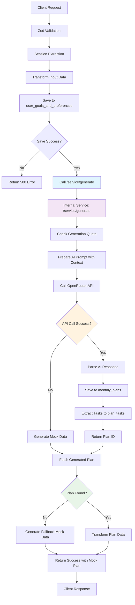

# POST /api/plan/generate Endpoint - Detailed Code Review

## Overview
The POST `/api/plan/generate` endpoint is a comprehensive server function that orchestrates AI-powered monthly plan generation. It demonstrates sophisticated error handling, fallback mechanisms, and integration with multiple system components.

## Endpoint Signature
```typescript
POST /api/plan/generate
Content-Type: application/json

{
  goals: string (min 10 chars),
  complexity: 'Simple' | 'Moderate' | 'Ambitious',
  focusAreas: string (min 3 chars),
  weekendPreference: 'Deep Work' | 'Strategic Planning' | 'Learning & Development' | 'Light Tasks' | 'Rest & Recharge',
  fixedCommitments: string[] (default []),
  month?: string (optional)
}
```

## Code Flow Analysis

### Phase 1: Input Processing & Validation (Lines 54-76)

```typescript
const data = c.req.valid('json');  // Zod validation
const user = c.get("session")?.user;  // Auth session extraction
```

**Key Transformations:**
- `data.complexity === 'Moderate' ? 'Balanced' : data.complexity` - Maps UI-friendly terms to database enums
- Weekend preference mapping from detailed options to simple Work/Rest/Mixed categories
- Fixed commitments transformed into structured JSON objects with default Monday/09:00-10:00 scheduling

### Phase 2: Preference Storage (Lines 61-83)

Creates a new entry in `user_goals_and_preferences` table via `createGoalPreference`:
- **Table**: `user_goals_and_preferences`
- **Key Fields**: userId, goalsText, taskComplexity, focusAreas, weekendPreference, fixedCommitmentsJson
- **Error Handling**: Returns 500 if preference creation fails

### Phase 3: AI Generation via Internal Service (Lines 86-104)

Makes internal HTTP call to `/service/generate`:
```typescript
const response = await fetch(`${baseUrl}/service/generate`, {
  method: 'POST',
  headers: { 'Content-Type': 'application/json' },
  body: JSON.stringify({
    preferenceId: newPreference.id,
    userId: String(user?.id)
  })
});
```

**Architecture Pattern**: Public API → Internal Service separation
- Base URL from `API_BASE_URL` environment variable
- Graceful fallback to mock data if service fails

### Phase 4: Plan Retrieval & Transformation (Lines 105-162)

Fetches generated plan using `getCurrentMonthlyPlanWithTasks(userId, currentMonth)`:

**Success Path Transformation:**
```typescript
const transformedPlan = {
  id: planWithTasks.plan.id,
  title: `${planWithTasks.plan.month} Plan`,
  month: planWithTasks.plan.month,
  goals: planWithTasks.plan.goals ? planWithTasks.plan.goals.split(';').filter(g => g.trim()) : [data.goals],
  tasks: planWithTasks.tasks.map(task => ({
    id: task.id.toString(),
    title: task.title,
    description: task.description || '',
    dueDate: task.dueDate,
    priority: task.priority as 'High' | 'Medium' | 'Low',
    category: task.category,
    estimatedHours: task.estimatedHours || undefined
  })),
  totalTasks: planWithTasks.tasks.length,
  estimatedHours: planWithTasks.tasks.reduce((sum, task) => sum + (task.estimatedHours || 0), 0),
};
```

### Phase 5: Fallback Mechanism (Lines 110-137 & 167-194)

**Dual Fallback Strategy:**
1. **Primary Fallback** (lines 111-137): When generation succeeds but data unavailable
2. **Secondary Fallback** (lines 167-194): When generation fails completely

Both generate realistic mock data:
- 15 tasks with varied priorities (High/Medium/Low)
- Categories: Work, Personal, Health, Learning, Finance
- Random due dates within 30 days
- Estimated hours (1-8 hours per task)

## System Dependencies & Integrations

### Database Layer
- **`@testing-server/db`** package for all database operations
- **Query Functions**:
  - `createGoalPreference()` - Saves user preferences
  - `getCurrentMonthlyPlanWithTasks()` - Retrieves generated plans
- **Tables Involved**:
  - `user_goals_and_preferences` - Stores planning inputs
  - `monthly_plans` - Generated plan summaries
  - `plan_tasks` - Individual task details

### Internal Service Integration
- **Endpoint**: `/service/generate` (implemented in `services.ts`)
- **Purpose**: Handles AI generation logic separate from public API
- **Responsibility**: OpenRouter API calls, quota management, plan saving

### OpenRouter AI Integration
- **Service**: `OpenRouterService` in `apps/server/src/lib/openrouter.ts`
- **Default Model**: `anthropic/claude-3.5-sonnet`
- **Configuration**: Environment-based (API key, model, temperature, max tokens)
- **Fallback**: Returns mock data when API unavailable

## Error Handling Strategy

### Multi-Layered Approach

1. **Input Validation** (Zod schema)
   - Type safety enforcement
   - Minimum length requirements
   - Enum value constraints

2. **Database Operation Errors**
   - Preference creation failure → 500 response
   - Plan retrieval failure → structured mock data

3. **Service Call Errors**
   - Network failures to internal service
   - Service returns error status
   - Both handled with fallback to mock data

4. **Unhandled Exceptions**
   - Generic catch block (lines 197-203)
   - Consistent error response format
   - Proper HTTP status codes

## Data Flow Architecture



## Key Design Patterns

### 1. **Graceful Degradation**
- System remains functional even when:
  - OpenRouter API is unavailable
  - Database operations fail
  - Network issues occur
- Always returns useful plan data to user

### 2. **Separation of Concerns**
- Public API handles validation and response formatting
- Internal service handles business logic and AI integration
- Database layer handles data persistence
- Each layer can be tested and scaled independently

### 3. **Context-Aware Generation**
- User preferences saved for future reference
- Historical productivity insights incorporated
- Fixed commitments considered in scheduling
- Quota limits prevent abuse

### 4. **Data Transformation Pipeline**
- UI-friendly enums → Database enums
- Complex weekend preferences → Simple categories
- Text commitments → Structured JSON objects
- Database records → API response format

## Performance Considerations

### Potential Bottlenecks
1. **OpenRouter API Latency**: External service call (variable response time)
2. **Database Operations**: Multiple queries across different tables
3. **Internal HTTP Call**: Additional network hop to `/service/generate`

### Optimization Opportunities
1. **Async Processing**: Could make AI generation asynchronous
2. **Caching**: Cache frequently accessed user preferences
3. **Batch Operations**: Combine multiple database operations
4. **Connection Pooling**: Ensure optimal database connection management

## Security Considerations

### Input Validation
- Zod schema validation prevents injection attacks
- Type safety ensures data integrity
- Length constraints prevent DoS via large inputs

### Authentication
- Session validation ensures only authenticated users can generate plans
- User ID extraction prevents cross-user data access

### Quota Management
- Prevents abuse via generation limits per user per month
- Database-enforced constraints ensure fair usage

## Code Quality Assessment

### Strengths
- **Comprehensive Error Handling**: Multiple fallback mechanisms
- **Type Safety**: Full TypeScript integration with Zod validation
- **Modular Design**: Clear separation of concerns
- **Testability**: Each component can be unit tested independently
- **Documentation**: Clear code structure and comments

### Areas for Improvement
1. **Magic Strings**: Hardcoded categories and priorities could be configurable
2. **Error Messages**: Could be more user-friendly and specific
3. **Logging**: Enhanced logging would help debugging production issues
4. **Configuration**: Some hardcoded values could be environment variables
5. **Response Time**: Could benefit from async processing for AI generation

## Testing Strategy

### Unit Tests Needed
1. **Input Validation**: Test all validation scenarios
2. **Data Transformation**: Verify enum mappings and data structure changes
3. **Error Handling**: Test each failure path and fallback mechanism
4. **Mock Data Generation**: Ensure realistic fallback data

### Integration Tests Needed
1. **End-to-End Flow**: Complete request/response cycle
2. **Database Integration**: Verify data persistence and retrieval
3. **Service Integration**: Test internal HTTP calls
4. **AI Integration**: Test OpenRouter API interaction

### Performance Tests Needed
1. **Load Testing**: Multiple concurrent plan generations
2. **Stress Testing**: System behavior under heavy load
3. **Latency Testing**: Response time under various conditions

## Conclusion

The POST `/api/plan/generate` endpoint demonstrates enterprise-grade software engineering practices with robust error handling, clear separation of concerns, and graceful degradation mechanisms. The code is well-structured, type-safe, and maintainable. While there are opportunities for optimization and configuration improvements, the current implementation provides a solid foundation for AI-powered plan generation with excellent user experience even in failure scenarios.