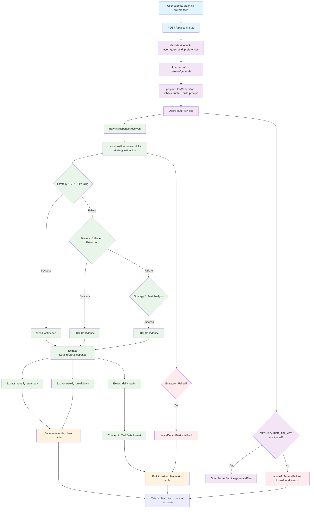

# AI Data Flow Analysis and Diagram

## Overview

Based on my analysis of the `packages/api` directory and the broader codebase, this document explains how AI data is received, parsed, and saved in the system.

## Current Understanding

The `packages/api` directory serves as a **shared library package** that provides:

1. **AI Response Processing**: `response-extractor.ts` - Multi-strategy extraction with confidence scoring
2. **Type Definitions**: `types/ai-response.ts` - Comprehensive type system for AI data
3. **Service Functions**: `services/plan-generation.ts` - Business logic for processing AI responses
4. **Router Components**: `routers/plan.ts` - Reusable API endpoint handlers
5. **OpenRouter Integration**: `lib/openrouter.ts` - AI service abstraction

## Complete Data Flow Analysis

### 1. Data Reception Layer

**Entry Point**: `POST /api/plan/inputs` (in `apps/server/src/router/plan.ts`)

- User submits planning preferences (goals, complexity, focus areas, etc.)
- Data saved to `user_goals_and_preferences` table
- Internal service call to `/service/generate`

### 2. AI Service Layer

**Processing**: `/service/generate` (in `apps/server/src/router/services.ts`)

- Uses `preparePlanGeneration()` to build comprehensive prompt
- Calls OpenRouter API via `packages/api/src/lib/openrouter.ts`
- Receives raw AI response with metadata

### 3. Response Processing Layer

**Extraction**: `packages/api/src/lib/response-extractor.ts`

- **Multi-strategy approach**:
  - Strategy 1: JSON parsing (90% confidence)
  - Strategy 2: Pattern-based regex extraction (60% confidence)
  - Strategy 3: Text analysis fallback (30% confidence)
- **Key extraction methods**:
  - `extractMonthlySummary()` - Overview extraction
  - `extractWeeklyBreakdown()` - Weekly structure parsing
  - `extractDailyTasks()` - Daily task breakdown
  - `extractTasksFromBreakdown()` - Database-ready task conversion

### 4. Data Storage Layer

**Persistence**: Database operations via `packages/db/src/queries/plan-generation.ts`

- `monthly_plans` table: AI responses, metadata, confidence scores
- `plan_tasks` table: Individual tasks with scheduling details
- Fallback to `createDefaultTasks()` if extraction fails

## Data Flow Diagram

## Key Insights

### packages/api Role

The `packages/api` directory **does not directly receive or save data**. Instead, it provides:

1. **Processing Logic**: Response extraction and data transformation
2. **Type Safety**: Comprehensive TypeScript definitions
3. **Service Abstractions**: Reusable business logic functions
4. **AI Integration**: OpenRouter service wrapper

### Data Flow Pattern

1. **Reception**: `apps/server` receives HTTP requests
2. **Processing**: `packages/api` processes AI responses
3. **Storage**: `packages/db` handles database operations
4. **Response**: `apps/server` returns results to user

### Architecture Benefits

- **Separation of Concerns**: Each package has clear responsibilities
- **Reusability**: `packages/api` can be used by different applications
- **Robustness**: Multi-strategy extraction ensures data is always captured
- **Observability**: Confidence scoring and detailed logging

## Detailed Component Breakdown

### Response Extraction Strategies

The `response-extractor.ts` implements a sophisticated multi-strategy approach:

1. **JSON Parsing Strategy** (`tryJsonExtraction`)
   - Attempts direct JSON parsing first
   - Falls back to extracting JSON from within text
   - Highest confidence (90%) when successful

2. **Pattern-Based Extraction** (`extractByPatterns`)
   - Uses regex patterns to extract key fields
   - Handles semi-structured responses
   - Medium confidence (60%)

3. **Text Analysis Fallback** (`extractByTextAnalysis`)
   - Basic text processing for unstructured responses
   - Generates default structures when needed
   - Low confidence (30%)

### Database Schema Integration

The extracted data flows into two main tables:

**monthly_plans**:

- `aiPrompt`: Complete prompt sent to AI
- `aiResponseRaw`: Extracted structured data
- `rawAiResponse`: Original AI response
- `monthlySummary`: Generated overview
- `extractionConfidence`: Quality score (0-100%)
- `extractionNotes`: Processing metadata

**plan_tasks**:

- Individual tasks extracted from weekly breakdowns
- Mapped from AI response format to database schema
- Includes scheduling, priority, and categorization

### Error Handling and Fallbacks

The system includes comprehensive error handling:

- **API Configuration**: Clear error messages for missing API keys
- **Quota Management**: Prevents abuse with monthly generation limits
- **Extraction Failures**: Creates default tasks when extraction fails
- **Data Validation**: Ensures data integrity throughout the pipeline

## Conclusion

The data flows from user input → AI service → response processing → database storage, with `packages/api` serving as the critical processing layer that transforms raw AI responses into structured, database-ready data through sophisticated extraction strategies. This architecture ensures robustness, maintainability, and clear separation of concerns across the monorepo.
