# Cracked Hybrid Plan Generation Architecture

## 🎯 Executive Summary

This document outlines the "Cracked" hybrid approach that combines the best of both worlds: the immediate response of Direct Response (Approach 1) with the safety net of Staging Tables (Approach 2). This architecture provides maximum flexibility, minimal complexity, and optimal user experience.

## 🔄 Architecture Overview

### Current State Analysis

- **Approach 1 (Direct Response)**: Fast but no preview, risky for data loss
- **Approach 2 (Staging Table)**: Safe but slow, multiple API calls, complex

### The "Cracked" Solution

- **Primary Path**: Direct response with conditional persistence
- **Fallback**: Optional staging for recovery
- **User Control**: Choice between immediate save vs preview-first
- **Resilience**: Always returns plan data, save can fail independently

## 🏗️ Architecture Design

### Architecture Flow Diagram

```mermaid
graph TD
    A[User Request] --> B[Hybrid Generate API]
    B --> C[Load User Preferences]
    C --> D[Prepare Generation Context]
    D --> E[Call AI Service]
    E --> F[Parse AI Response]
    F --> G{Decision Engine}
    
    G -->|immediate mode| H[Direct Save]
    G -->|preview mode + backup| I[Lightweight Staging]
    G -->|preview mode only| J[In-Memory Only]
    G -->|auto mode| K[Smart Context Analysis]
    
    K --> L{Should Save Immediately?}
    L -->|Yes| H
    L -->|No| M{Create Staging Backup?}
    M -->|Yes| I
    M -->|No| J
    
    H --> N[Return: planData + planId]
    I --> O[Return: planData + stagingKey]
    J --> P[Return: planData only]
    
    N --> Q[Show Plan: Saved ✓]
    O --> R[Show Plan: Staged 💾]
    P --> S[Show Plan: Preview 👁️]
    
    R --> T[User Decision]
    T -->|Save| U[Save from Preview]
    T -->|Discard| V[Delete Staging]
    T -->|Keep| W[Auto-extend Expiry]
    
    U --> X[Permanent Storage]
    X --> Y[Plan Saved ✓]
    
    style H fill:#90EE90
    style I fill:#FFD700
    style J fill:#87CEEB
    style X fill:#90EE90
    style Y fill:#90EE90
```



### System Architecture Diagram


### Decision Logic Flow


### Core Principles

1. **Response-First**: Always return plan data immediately
2. **Conditional Persistence**: Save strategy based on user preference
3. **Graceful Degradation**: Plan visible even if save fails
4. **Smart Fallbacks**: Multiple recovery paths
5. **Resource Optimization**: Minimal database operations

## 📋 Database Schema Changes

### New: `plan_generation_options` Table

```sql
CREATE TABLE plan_generation_options (
  id SERIAL PRIMARY KEY,
  user_id TEXT NOT NULL REFERENCES user(id),
  default_save_mode TEXT NOT NULL DEFAULT 'preview', -- 'immediate' | 'preview' | 'auto'
  auto_create_staging BOOLEAN DEFAULT true,
  staging_ttl_hours INTEGER DEFAULT 24,
  preference_strength TEXT DEFAULT 'balanced', -- 'speed' | 'safety' | 'balanced'
  created_at TIMESTAMP DEFAULT NOW(),
  updated_at TIMESTAMP DEFAULT NOW()
);
```

### Enhanced: `plan_staging` Table Modifications

```sql
-- Add lightweight staging flag
ALTER TABLE plan_staging 
ADD COLUMN is_lightweight BOOLEAN DEFAULT false,
ADD COLUMN access_count INTEGER DEFAULT 0;

-- Index for performance
CREATE INDEX idx_plan_staging_lightweight ON plan_staging(is_lightweight, expires_at);
```

### Enhanced: `monthly_plans` Table

```sql
-- Add generation context
ALTER TABLE monthly_plans 
ADD COLUMN generation_mode TEXT NOT NULL DEFAULT 'preview', -- 'immediate' | 'preview' | 'staging'
ADD COLUMN save_timestamp TIMESTAMP,
ADD COLUMN generation_latency_ms INTEGER;
```

## 🔧 Backend Implementation

### Step 1: New Database Queries

#### File: `packages/db/src/queries/hybrid-generation.ts`

```typescript
import { db } from "../index";
import { eq, and, gt } from "drizzle-orm";
import { planGenerationOptions, planStaging, monthlyPlans } from "../schema";

export interface GenerationOptions {
  defaultSaveMode: 'immediate' | 'preview' | 'auto';
  autoCreateStaging: boolean;
  stagingTtlHours: number;
  preferenceStrength: 'speed' | 'safety' | 'balanced';
}

export async function getUserGenerationOptions(userId: string): Promise<GenerationOptions> {
  const [options] = await db
    .select()
    .from(planGenerationOptions)
    .where(eq(planGenerationOptions.userId, userId));

  if (!options) {
    // Create default options for new user
    const defaultOptions: GenerationOptions = {
      defaultSaveMode: 'preview',
      autoCreateStaging: true,
      stagingTtlHours: 24,
      preferenceStrength: 'balanced'
    };
    
    await createUserGenerationOptions(userId, defaultOptions);
    return defaultOptions;
  }

  return {
    defaultSaveMode: options.defaultSaveMode as any,
    autoCreateStaging: options.autoCreateStaging,
    stagingTtlHours: options.stagingTtlHours,
    preferenceStrength: options.preferenceStrength as any
  };
}

export async function createUserGenerationOptions(
  userId: string, 
  options: Partial<GenerationOptions>
): Promise<void> {
  await db.insert(planGenerationOptions).values({
    userId,
    defaultSaveMode: options.defaultSaveMode || 'preview',
    autoCreateStaging: options.autoCreateStaging ?? true,
    stagingTtlHours: options.stagingTtlHours || 24,
    preferenceStrength: options.preferenceStrength || 'balanced'
  });
}

export async function updateUserGenerationOptions(
  userId: string,
  options: Partial<GenerationOptions>
): Promise<void> {
  await db
    .update(planGenerationOptions)
    .set({
      ...options,
      updatedAt: new Date()
    })
    .where(eq(planGenerationOptions.userId, userId));
}

export async function createLightweightStaging(
  userId: string,
  stagingKey: string,
  planData: any,
  monthYear: string,
  preferenceId: number,
  ttlHours: number = 24
): Promise<any> {
  const expiresAt = new Date();
  expiresAt.setHours(expiresAt.getHours() + ttlHours);

  const [stagingPlan] = await db.insert(planStaging).values({
    userId,
    stagingKey,
    planData,
    extractionConfidence: null, // Skip confidence calc for lightweight
    extractionNotes: 'Lightweight staging for preview',
    aiResponseRaw: null, // Don't store raw response for lightweight
    expiresAt,
    monthYear,
    preferencesId: preferenceId,
    isLightweight: true
  }).returning();

  return stagingPlan;
}

export async function incrementStagingAccess(stagingKey: string): Promise<void> {
  await db
    .update(planStaging)
    .set({
      accessCount: sql`${planStaging.accessCount} + 1`
    })
    .where(eq(planStaging.stagingKey, stagingKey));
}

export async function saveFromStaging(
  stagingKey: string,
  aiResponseRaw?: any
): Promise<number> {
  const stagingPlan = await getStagingPlan(stagingKey);
  if (!stagingPlan) {
    throw new Error('Staging plan not found');
  }

  // Update staging with raw response if provided
  if (aiResponseRaw) {
    await db
      .update(planStaging)
      .set({ aiResponseRaw })
      .where(eq(planStaging.stagingKey, stagingKey));
  }

  // Save to permanent storage
  const planId = await saveGeneratedPlan(
    stagingPlan.userId,
    stagingPlan.preferencesId!,
    stagingPlan.monthYear,
    '', // prompt - could be retrieved if needed
    aiResponseRaw || { 
      rawContent: JSON.stringify(stagingPlan.planData), 
      metadata: { contentLength: 0, format: 'json' as const } 
    }
  );

  // Mark as saved
  await markStagingPlanAsSaved(stagingKey);

  return planId;
}

// Auto-decision logic for hybrid mode
export function shouldSaveImmediately(
  userOptions: GenerationOptions,
  context: {
    isFirstTimeUser: boolean;
    hasGoodHistory: boolean;
    currentQuota: number;
    planComplexity: 'simple' | 'moderate' | 'complex';
  }
): boolean {
  const { defaultSaveMode, preferenceStrength } = userOptions;

  // Explicit modes
  if (defaultSaveMode === 'immediate') return true;
  if (defaultSaveMode === 'preview') return false;

  // Auto mode - smart decision based on context
  if (defaultSaveMode === 'auto') {
    // Safety-first users get immediate save for complex plans
    if (preferenceStrength === 'safety' && context.planComplexity === 'complex') {
      return true;
    }

    // Speed-first users get preview mode unless high quota usage
    if (preferenceStrength === 'speed' && context.currentQuota < 0.8) {
      return false;
    }

    // Balanced: immediate save for experienced users with good history
    if (preferenceStrength === 'balanced' && !context.isFirstTimeUser && context.hasGoodHistory) {
      return true;
    }
  }

  return false; // Default to preview
}
```

### Step 2: Enhanced Service Layer

#### File: `packages/api/src/routers/hybrid-services.ts`

```typescript
import { Hono } from 'hono';
import { zValidator } from '@hono/zod-validator';
import { z } from 'zod';
import {
  preparePlanGeneration,
  saveGeneratedPlan,
  getUserGenerationOptions,
  createLightweightStaging,
  incrementStagingAccess,
  shouldSaveImmediately,
  getUserProductivityInsights
} from '@testing-server/db';
import { getOpenRouterService } from '../lib/openrouter';
import { responseExtractor } from '@testing-server/response-parser';

const hybridGenerateSchema = z.object({
  preferenceId: z.number(),
  userId: z.string(),
  saveMode: z.enum(['immediate', 'preview', 'auto']).optional(),
  createStagingBackup: z.boolean().optional(),
  overrideUserPreferences: z.boolean().optional()
});

export const hybridServicesRouter = new Hono();

// POST /service/hybrid-generate - Main hybrid generation endpoint
hybridServicesRouter.post('/hybrid-generate', 
  zValidator('json', hybridGenerateSchema),
  async (c) => {
    const startTime = Date.now();
    
    try {
      const { 
        preferenceId, 
        userId, 
        saveMode: requestedSaveMode,
        createStagingBackup: requestedStaging,
        overrideUserPreferences = false
      } = c.req.valid('json');

      // 1. Get user preferences (unless overridden)
      const userOptions = overrideUserPreferences 
        ? {
            defaultSaveMode: 'preview' as const,
            autoCreateStaging: true,
            stagingTtlHours: 24,
            preferenceStrength: 'balanced' as const
          }
        : await getUserGenerationOptions(userId);

      // 2. Prepare generation context
      const planData = await preparePlanGeneration(preferenceId, userId);
      
      // 3. Analyze user context for auto-decision
      const insights = await getUserProductivityInsights(userId);
      const hasGoodHistory = insights.some(i => i.completionRate > 0.7);
      const isFirstTimeUser = insights.length === 0;
      const planComplexity = determinePlanComplexity(planData.prompt);

      const context = {
        isFirstTimeUser,
        hasGoodHistory,
        currentQuota: 0.5, // Would need to calculate from quota table
        planComplexity
      };

      // 4. Determine save strategy
      const saveMode = requestedSaveMode || userOptions.defaultSaveMode;
      const shouldSave = saveMode === 'immediate' || 
        (saveMode === 'auto' && shouldSaveImmediately(userOptions, context));
      
      const shouldCreateStaging = requestedStaging ?? 
        (userOptions.autoCreateStaging && !shouldSave);

      // 5. Generate AI response
      const openRouterService = getOpenRouterService();
      const aiResponse = await openRouterService.generatePlan(planData.prompt);
      
      console.log(`Hybrid generation: mode=${saveMode}, shouldSave=${shouldSave}, shouldStaging=${shouldCreateStaging}`);

      // 6. Parse and structure the response
      const parsedResponse = responseExtractor.extractAllStructuredData(aiResponse.rawContent);
      const monthlyPlan = responseExtractor.convertToMonthlyPlan(parsedResponse, planData.monthYear);

      let planId: number | undefined;
      let stagingKey: string | undefined;
      let generationMode: 'immediate' | 'preview' | 'staging';

      // 7. Conditional persistence
      if (shouldSave) {
        // Direct save to permanent storage
        planId = await saveGeneratedPlan(
          userId,
          preferenceId,
          planData.monthYear,
          planData.prompt,
          aiResponse
        );
        generationMode = 'immediate';
      } else if (shouldCreateStaging) {
        // Create lightweight staging
        stagingKey = generateStagingKey(userId);
        const stagingPlan = await createLightweightStaging(
          userId,
          stagingKey,
          monthlyPlan,
          planData.monthYear,
          preferenceId,
          userOptions.stagingTtlHours
        );
        generationMode = 'staging';
      } else {
        // In-memory only
        generationMode = 'preview';
      }

      // 8. Log generation metrics
      const latency = Date.now() - startTime;
      await logGenerationMetrics(userId, {
        mode: saveMode,
        generationMode,
        shouldSave,
        shouldCreateStaging,
        latency,
        planComplexity,
        success: true
      });

      // 9. Return comprehensive response
      return c.json({
        success: true,
        data: {
          planData: monthlyPlan,
          planId,
          stagingKey,
          generationMode,
          userOptions: {
            defaultSaveMode: userOptions.defaultSaveMode,
            autoCreateStaging: userOptions.autoCreateStaging
          },
          metadata: {
            latency,
            generatedAt: new Date().toISOString(),
            extractionConfidence: parsedResponse.metadata.confidence,
            context: {
              isFirstTimeUser,
              hasGoodHistory,
              planComplexity
            }
          }
        },
        message: generationMode === 'immediate' 
          ? 'Plan generated and saved successfully'
          : generationMode === 'staging'
          ? 'Plan generated and staged for review'
          : 'Plan generated for preview'
      });

    } catch (error) {
      const latency = Date.now() - startTime;
      
      // Log failure metrics
      await logGenerationMetrics(userId, {
        mode: 'unknown',
        generationMode: 'failed',
        shouldSave: false,
        shouldCreateStaging: false,
        latency,
        planComplexity: 'unknown',
        success: false,
        error: error instanceof Error ? error.message : 'Unknown error'
      });

      console.error('Hybrid generation failed:', error);
      
      // Try graceful fallback to mock data
      try {
        const mockPlan = generateMockPlan();
        return c.json({
          success: true,
          data: {
            planData: mockPlan,
            planId: undefined,
            stagingKey: undefined,
            generationMode: 'preview' as const,
            fallback: true,
            userOptions: {
              defaultSaveMode: 'preview',
              autoCreateStaging: true
            },
            metadata: {
              latency,
              generatedAt: new Date().toISOString(),
              extractionConfidence: 0,
              error: 'AI generation failed, using fallback'
            }
          },
          message: 'Plan generated using fallback data'
        });
      } catch (fallbackError) {
        return c.json({
          success: false,
          error: 'Both AI generation and fallback failed',
          details: error instanceof Error ? error.message : 'Unknown error'
        }, 500);
      }
    }
  }
);

// POST /service/save-from-preview - Save a previously generated plan
hybridServicesRouter.post('/save-from-preview', 
  zValidator('json', z.object({
    userId: z.string(),
    preferenceId: z.number(),
    monthYear: z.string(),
    planData: z.any(),
    stagingKey: z.string().optional(),
    aiPrompt: z.string().optional()
  })),
  async (c) => {
    try {
      const { userId, preferenceId, monthYear, planData, stagingKey, aiPrompt } = c.req.valid('json');

      let planId: number;

      if (stagingKey) {
        // Save from existing staging
        await incrementStagingAccess(stagingKey);
        planId = await saveFromStaging(stagingKey, {
          rawContent: JSON.stringify(planData),
          metadata: { contentLength: JSON.stringify(planData).length, format: 'json' as const }
        });
      } else {
        // Direct save from preview
        planId = await saveGeneratedPlan(
          userId,
          preferenceId,
          monthYear,
          aiPrompt || 'Generated from preview',
          {
            rawContent: JSON.stringify(planData),
            metadata: { contentLength: JSON.stringify(planData).length, format: 'json' as const }
          }
        );
      }

      return c.json({
        success: true,
        data: { planId },
        message: 'Plan saved successfully from preview'
      });

    } catch (error) {
      console.error('Save from preview failed:', error);
      return c.json({
        success: false,
        error: error instanceof Error ? error.message : 'Failed to save plan'
      }, 500);
    }
  }
);

// PUT /service/generation-options - Update user generation preferences
hybridServicesRouter.put('/generation-options', 
  zValidator('json', z.object({
    userId: z.string(),
    defaultSaveMode: z.enum(['immediate', 'preview', 'auto']).optional(),
    autoCreateStaging: z.boolean().optional(),
    stagingTtlHours: z.number().min(1).max(168).optional(), // 1 hour to 1 week
    preferenceStrength: z.enum(['speed', 'safety', 'balanced']).optional()
  })),
  async (c) => {
    try {
      const { userId, ...options } = c.req.valid('json');

      await updateUserGenerationOptions(userId, options);

      return c.json({
        success: true,
        message: 'Generation preferences updated successfully'
      });

    } catch (error) {
      console.error('Update generation options failed:', error);
      return c.json({
        success: false,
        error: error instanceof Error ? error.message : 'Failed to update preferences'
      }, 500);
    }
  }
);

// Helper functions
function generateStagingKey(userId: string): string {
  const timestamp = Date.now();
  const random = Math.random().toString(36).substring(2, 8);
  return `${userId}_${timestamp}_${random}`;
}

function determinePlanComplexity(prompt: string): 'simple' | 'moderate' | 'complex' {
  const wordCount = prompt.split(/\s+/).length;
  const goalCount = (prompt.match(/goal|objective|target/gi) || []).length;
  
  if (wordCount > 500 || goalCount > 5) return 'complex';
  if (wordCount > 200 || goalCount > 2) return 'moderate';
  return 'simple';
}

async function logGenerationMetrics(
  userId: string, 
  metrics: any
): Promise<void> {
  // Implementation would log to analytics table or external service
  console.log(`Generation metrics for ${userId}:`, metrics);
}

function generateMockPlan(): any {
  // Return a basic mock plan structure
  return {
    monthly_summary: "Fallback plan generated for preview",
    weekly_breakdown: [
      {
        week: 1,
        focus: "Basic setup and planning",
        goals: ["Set up your environment", "Define your objectives"],
        daily_tasks: {
          Monday: [{
            task_description: "Review your goals",
            focus_area: "Planning",
            start_time: new Date().toISOString(),
            end_time: new Date(Date.now() + 3600000).toISOString(),
            difficulty_level: "simple",
            scheduling_reason: "Start your week with clarity"
          }]
        }
      }
    ]
  };
}
```

### Step 3: Updated Public API

#### File: `apps/server/src/router/hybrid-plan.ts`

```typescript
import { Hono } from 'hono';
import { zValidator } from '@hono/zod-validator';
import { z } from 'zod';
import {
  createGoalPreference,
  getLatestGoalPreference,
  getUserGenerationOptions,
  updateTaskStatus,
  logActivity
} from '@testing-server/db';
import type { Variables } from '../index';

const hybridGenerateInputSchema = z.object({
  userId: z.string(),
  goalsText: z.string().min(1),
  taskComplexity: z.enum(['Simple', 'Balanced', 'Ambitious']),
  focusAreas: z.string().min(1),
  weekendPreference: z.enum(['Work', 'Rest', 'Mixed']),
  fixedCommitmentsJson: z.object({
    commitments: z.array(z.object({
      dayOfWeek: z.string(),
      startTime: z.string(),
      endTime: z.string(),
      description: z.string()
    }))
  }),
  // New hybrid options
  saveMode: z.enum(['immediate', 'preview', 'auto']).optional(),
  createStagingBackup: z.boolean().optional(),
  overrideUserPreferences: z.boolean().optional()
});

export const hybridPlanRouter = new Hono<{ Variables: Variables }>();

// POST /api/hybrid-plan/generate - Main public endpoint
hybridPlanRouter.post('/generate', 
  zValidator('json', hybridGenerateInputSchema),
  async (c) => {
    try {
      const data = c.req.valid('json');
      const userId = c.get('session')?.user?.id || data.userId;

      console.log("Hybrid plan generation request:", {
        userId,
        saveMode: data.saveMode,
        createStagingBackup: data.createStagingBackup
      });

      // 1. Save user preferences/goals
      const newPreference = await createGoalPreference({
        userId: data.userId,
        goalsText: data.goalsText,
        taskComplexity: data.taskComplexity,
        focusAreas: data.focusAreas,
        weekendPreference: data.weekendPreference,
        fixedCommitmentsJson: data.fixedCommitmentsJson
      });

      if (!newPreference) {
        return c.json({
          success: false,
          error: 'Failed to save planning inputs'
        }, 500);
      }

      // 2. Call hybrid generation service
      const baseUrl = process.env.API_BASE_URL;
      const response = await fetch(`${baseUrl}/service/hybrid-generate`, {
        method: 'POST',
        headers: {
          'Content-Type': 'application/json',
        },
        body: JSON.stringify({
          preferenceId: newPreference.id,
          userId: data.userId,
          saveMode: data.saveMode,
          createStagingBackup: data.createStagingBackup,
          overrideUserPreferences: data.overrideUserPreferences
        })
      });

      const result = await response.json();

      if (!response.ok || !result.success) {
        throw new Error(result.error || 'Hybrid generation failed');
      }

      // 3. Return enhanced response with preference info
      return c.json({
        success: true,
        preferenceId: newPreference.id,
        data: result.data,
        message: result.message,
        userContext: {
          hasUserPreferences: true,
          preferenceSaved: true
        }
      });

    } catch (error) {
      console.error('Hybrid plan generation failed:', error);
      return c.json({
        success: false,
        error: error instanceof Error ? error.message : 'Hybrid generation failed'
      }, 500);
    }
  }
);

// POST /api/hybrid-plan/save-from-preview - Save a previewed plan
hybridPlanRouter.post('/save-from-preview',
  zValidator('json', z.object({
    userId: z.string(),
    planData: z.any(),
    stagingKey: z.string().optional(),
    preferenceId: z.number().optional()
  })),
  async (c) => {
    try {
      const { userId, planData, stagingKey, preferenceId } = c.req.valid('json');

      // Get preference ID if not provided
      const finalPreferenceId = preferenceId || 
        (await getLatestGoalPreference(userId))?.id;

      if (!finalPreferenceId) {
        return c.json({
          success: false,
          error: 'No preference found. Please generate a plan first.'
        }, 400);
      }

      // Call service to save
      const baseUrl = process.env.API_BASE_URL;
      const response = await fetch(`${baseUrl}/service/save-from-preview`, {
        method: 'POST',
        headers: {
          'Content-Type': 'application/json',
        },
        body: JSON.stringify({
          userId,
          preferenceId: finalPreferenceId,
          monthYear: new Date().toISOString().slice(0, 7) + '-01',
          planData,
          stagingKey
        })
      });

      const result = await response.json();

      if (!response.ok || !result.success) {
        throw new Error(result.error || 'Save from preview failed');
      }

      return c.json({
        success: true,
        data: result.data,
        message: 'Plan saved successfully'
      });

    } catch (error) {
      console.error('Save from preview failed:', error);
      return c.json({
        success: false,
        error: error instanceof Error ? error.message : 'Failed to save plan'
      }, 500);
    }
  }
);

// GET /api/hybrid-plan/generation-options - Get user's generation preferences
hybridPlanRouter.get('/generation-options', async (c) => {
  try {
    const userId = c.get('session')?.user?.id || c.req.query('userId');

    if (!userId) {
      return c.json({ error: 'User authentication required' }, 401);
    }

    const options = await getUserGenerationOptions(userId);

    return c.json({
      success: true,
      data: options
    });

  } catch (error) {
    console.error('Get generation options failed:', error);
    return c.json({
      success: false,
      error: 'Failed to get generation options'
    }, 500);
  }
});

// PUT /api/hybrid-plan/generation-options - Update user's generation preferences
hybridPlanRouter.put('/generation-options',
  zValidator('json', z.object({
    defaultSaveMode: z.enum(['immediate', 'preview', 'auto']).optional(),
    autoCreateStaging: z.boolean().optional(),
    stagingTtlHours: z.number().min(1).max(168).optional(),
    preferenceStrength: z.enum(['speed', 'safety', 'balanced']).optional()
  })),
  async (c) => {
    try {
      const userId = c.get('session')?.user?.id || c.req.query('userId');
      const options = c.req.valid('json');

      if (!userId) {
        return c.json({ error: 'User authentication required' }, 401);
      }

      // Call service to update options
      const baseUrl = process.env.API_BASE_URL;
      const response = await fetch(`${baseUrl}/service/generation-options`, {
        method: 'PUT',
        headers: {
          'Content-Type': 'application/json',
        },
        body: JSON.stringify({
          userId,
          ...options
        })
      });

      const result = await response.json();

      if (!response.ok || !result.success) {
        throw new Error(result.error || 'Update generation options failed');
      }

      return c.json({
        success: true,
        message: result.message
      });

    } catch (error) {
      console.error('Update generation options failed:', error);
      return c.json({
        success: false,
        error: error instanceof Error ? error.message : 'Failed to update options'
      }, 500);
    }
  }
);
```

### Step 4: Frontend Integration

#### File: `apps/web/src/functions/hybrid-plan-generation.ts`

```typescript
export interface HybridPlanRequest {
  userId: string;
  goalsText: string;
  taskComplexity: 'Simple' | 'Balanced' | 'Ambitious';
  focusAreas: string;
  weekendPreference: 'Work' | 'Rest' | 'Mixed';
  fixedCommitmentsJson: {
    commitments: Array<{
      dayOfWeek: string;
      startTime: string;
      endTime: string;
      description: string;
    }>;
  };
  // Hybrid options
  saveMode?: 'immediate' | 'preview' | 'auto';
  createStagingBackup?: boolean;
  overrideUserPreferences?: boolean;
}

export interface HybridPlanResponse {
  success: boolean;
  preferenceId: number;
  data: {
    planData: MonthlyPlan;
    planId?: number;
    stagingKey?: string;
    generationMode: 'immediate' | 'preview' | 'staging';
    userOptions: {
      defaultSaveMode: string;
      autoCreateStaging: boolean;
    };
    metadata: {
      latency: number;
      generatedAt: string;
      extractionConfidence: number;
      context: {
        isFirstTimeUser: boolean;
        hasGoodHistory: boolean;
        planComplexity: string;
      };
    };
    fallback?: boolean;
  };
  message: string;
  userContext: {
    hasUserPreferences: boolean;
    preferenceSaved: boolean;
  };
}

export async function generateHybridPlan(
  request: HybridPlanRequest
): Promise<HybridPlanResponse> {
  const currentApiBaseUrl = getApiBaseUrl();

  const response = await fetch(`${currentApiBaseUrl}/api/hybrid-plan/generate`, {
    method: 'POST',
    headers: {
      'Content-Type': 'application/json',
    },
    body: JSON.stringify(request)
  });

  if (!response.ok) {
    const errorData = await response.json().catch(() => ({}));
    throw new Error(errorData.error || `HTTP ${response.status}: ${response.statusText}`);
  }

  return response.json();
}

export async function savePlanFromPreview(
  userId: string,
  planData: MonthlyPlan,
  stagingKey?: string,
  preferenceId?: number
): Promise<{ success: boolean; data?: { planId: number }; error?: string }> {
  const currentApiBaseUrl = getApiBaseUrl();

  try {
    const response = await fetch(`${currentApiBaseUrl}/api/hybrid-plan/save-from-preview`, {
      method: 'POST',
      headers: {
        'Content-Type': 'application/json',
      },
      body: JSON.stringify({
        userId,
        planData,
        stagingKey,
        preferenceId
      })
    });

    if (!response.ok) {
      const errorData = await response.json().catch(() => ({}));
      throw new Error(errorData.error || `HTTP ${response.status}`);
    }

    return response.json();
  } catch (error) {
    return {
      success: false,
      error: error instanceof Error ? error.message : 'Failed to save plan'
    };
  }
}

export async function getUserGenerationOptions(
  userId: string
): Promise<any> {
  const currentApiBaseUrl = getApiBaseUrl();

  const response = await fetch(`${currentApiBaseUrl}/api/hybrid-plan/generation-options?userId=${userId}`);

  if (!response.ok) {
    throw new Error(`Failed to get generation options: ${response.statusText}`);
  }

  const result = await response.json();
  return result.data;
}

export async function updateUserGenerationOptions(
  userId: string,
  options: {
    defaultSaveMode?: 'immediate' | 'preview' | 'auto';
    autoCreateStaging?: boolean;
    stagingTtlHours?: number;
    preferenceStrength?: 'speed' | 'safety' | 'balanced';
  }
): Promise<{ success: boolean; error?: string }> {
  const currentApiBaseUrl = getApiBaseUrl();

  try {
    const response = await fetch(`${currentApiBaseUrl}/api/hybrid-plan/generation-options`, {
      method: 'PUT',
      headers: {
        'Content-Type': 'application/json',
      },
      body: JSON.stringify(options)
    });

    if (!response.ok) {
      const errorData = await response.json().catch(() => ({}));
      throw new Error(errorData.error || `HTTP ${response.status}`);
    }

    return { success: true };
  } catch (error) {
    return {
      success: false,
      error: error instanceof Error ? error.message : 'Failed to update options'
    };
  }
}

function getApiBaseUrl(): string {
  if (typeof window !== 'undefined') {
    return window.location.origin;
  }
  return process.env.VITE_API_BASE_URL || 'http://localhost:3000';
}
```

## 🎨 Frontend Component Implementation

### File: `apps/web/src/components/hybrid-plan-generator.tsx`

```typescript
import React, { useState, useEffect } from 'react';
import { Button } from './ui/button';
import { Card, CardContent, CardHeader, CardTitle } from './ui/card';
import { Alert, AlertDescription } from './ui/alert';
import { Badge } from './ui/badge';
import { 
  generateHybridPlan, 
  savePlanFromPreview,
  getUserGenerationOptions,
  updateUserGenerationOptions,
  type HybridPlanRequest,
  type HybridPlanResponse 
} from '../functions/hybrid-plan-generation';

interface HybridPlanGeneratorProps {
  userId: string;
  initialData?: {
    goalsText: string;
    taskComplexity: 'Simple' | 'Balanced' | 'Ambitious';
    focusAreas: string;
    weekendPreference: 'Work' | 'Rest' | 'Mixed';
    fixedCommitmentsJson: any;
  };
  onPlanGenerated?: (response: HybridPlanResponse) => void;
}

export const HybridPlanGenerator: React.FC<HybridPlanGeneratorProps> = ({
  userId,
  initialData,
  onPlanGenerated
}) => {
  const [isGenerating, setIsGenerating] = useState(false);
  const [isSaving, setIsSaving] = useState(false);
  const [generatedPlan, setGeneratedPlan] = useState<HybridPlanResponse | null>(null);
  const [userOptions, setUserOptions] = useState<any>(null);
  const [saveMode, setSaveMode] = useState<'immediate' | 'preview' | 'auto'>('auto');
  const [createStagingBackup, setCreateStagingBackup] = useState(true);
  const [error, setError] = useState<string | null>(null);

  // Load user's generation preferences on mount
  useEffect(() => {
    loadUserOptions();
  }, [userId]);

  const loadUserOptions = async () => {
    try {
      const options = await getUserGenerationOptions(userId);
      setUserOptions(options);
      setSaveMode(options.defaultSaveMode || 'auto');
      setCreateStagingBackup(options.autoCreateStaging !== false);
    } catch (error) {
      console.error('Failed to load user options:', error);
    }
  };

  const handleGenerate = async () => {
    if (!initialData) {
      setError('Please provide initial planning data');
      return;
    }

    setIsGenerating(true);
    setError(null);

    try {
      const request: HybridPlanRequest = {
        userId,
        ...initialData,
        saveMode,
        createStagingBackup,
        overrideUserPreferences: false
      };

      const response = await generateHybridPlan(request);
      
      setGeneratedPlan(response);
      onPlanGenerated?.(response);

    } catch (error) {
      setError(error instanceof Error ? error.message : 'Generation failed');
    } finally {
      setIsGenerating(false);
    }
  };

  const handleSaveFromPreview = async () => {
    if (!generatedPlan) return;

    setIsSaving(true);
    setError(null);

    try {
      const result = await savePlanFromPreview(
        userId,
        generatedPlan.data.planData,
        generatedPlan.data.stagingKey,
        generatedPlan.preferenceId
      );

      if (result.success) {
        // Update the plan data with the new planId
        setGeneratedPlan({
          ...generatedPlan,
          data: {
            ...generatedPlan.data,
            planId: result.data?.planId,
            generationMode: 'immediate' as const
          }
        });
      } else {
        setError(result.error || 'Save failed');
      }
    } catch (error) {
      setError(error instanceof Error ? error.message : 'Save failed');
    } finally {
      setIsSaving(false);
    }
  };

  const handleUpdatePreferences = async () => {
    try {
      await updateUserGenerationOptions(userId, {
        defaultSaveMode: saveMode,
        autoCreateStaging: createStagingBackup
      });
      
      await loadUserOptions(); // Reload to confirm
    } catch (error) {
      setError(error instanceof Error ? error.message : 'Failed to update preferences');
    }
  };

  const renderGenerationMode = () => {
    if (!generatedPlan) return null;

    const { generationMode, planId, stagingKey } = generatedPlan.data;
    
    return (
      <div className="flex items-center gap-2">
        <Badge variant={generationMode === 'immediate' ? 'default' : 'secondary'}>
          {generationMode === 'immediate' && 'Saved'}
          {generationMode === 'staging' && 'Staged'}
          {generationMode === 'preview' && 'Preview'}
        </Badge>
        
        {generationMode === 'preview' && (
          <Button
            size="sm"
            onClick={handleSaveFromPreview}
            disabled={isSaving}
          >
            {isSaving ? 'Saving...' : 'Save Plan'}
          </Button>
        )}
        
        {planId && (
          <Badge variant="outline">Plan #{planId}</Badge>
        )}
      </div>
    );
  };

  const renderPerformanceInfo = () => {
    if (!generatedPlan) return null;

    const { latency, extractionConfidence, context } = generatedPlan.data.metadata;
    
    return (
      <div className="flex items-center gap-4 text-sm text-muted-foreground">
        <span>Latency: {latency}ms</span>
        <span>Confidence: {extractionConfidence}%</span>
        <span>Complexity: {context.planComplexity}</span>
      </div>
    );
  };

  return (
    <div className="space-y-6">
      {/* Error Display */}
      {error && (
        <Alert variant="destructive">
          <AlertDescription>{error}</AlertDescription>
        </Alert>
      )}

      {/* Generation Options */}
      <Card>
        <CardHeader>
          <CardTitle>Generation Options</CardTitle>
        </CardHeader>
        <CardContent className="space-y-4">
          <div className="grid grid-cols-1 md:grid-cols-2 gap-4">
            <div>
              <label className="block text-sm font-medium mb-2">
                Save Mode
              </label>
              <select
                value={saveMode}
                onChange={(e) => setSaveMode(e.target.value as any)}
                className="w-full p-2 border rounded"
              >
                <option value="immediate">Save Immediately</option>
                <option value="preview">Preview First</option>
                <option value="auto">Auto (Recommended)</option>
              </select>
            </div>
            
            <div>
              <label className="block text-sm font-medium mb-2">
                Create Backup
              </label>
              <label className="flex items-center space-x-2">
                <input
                  type="checkbox"
                  checked={createStagingBackup}
                  onChange={(e) => setCreateStagingBackup(e.target.checked)}
                />
                <span>Create staging backup for preview mode</span>
              </label>
            </div>
          </div>
          
          <Button
            variant="outline"
            onClick={handleUpdatePreferences}
          >
            Save as Default
          </Button>
        </CardContent>
      </Card>

      {/* Generate Button */}
      <Card>
        <CardContent className="pt-6">
          <Button
            onClick={handleGenerate}
            disabled={isGenerating || !initialData}
            className="w-full"
            size="lg"
          >
            {isGenerating ? 'Generating Plan...' : 'Generate Hybrid Plan'}
          </Button>
        </CardContent>
      </Card>

      {/* Results Display */}
      {generatedPlan && (
        <Card>
          <CardHeader>
            <div className="flex items-center justify-between">
              <CardTitle>Generation Results</CardTitle>
              {renderGenerationMode()}
            </div>
          </CardHeader>
          <CardContent className="space-y-4">
            <div>
              <h4 className="font-medium mb-2">Plan Summary</h4>
              <p className="text-sm text-muted-foreground">
                {generatedPlan.data.planData.monthly_summary}
              </p>
            </div>
            
            <div>
              <h4 className="font-medium mb-2">User Context</h4>
              <div className="flex gap-2">
                {generatedPlan.data.metadata.context.isFirstTimeUser && (
                  <Badge variant="secondary">First Time User</Badge>
                )}
                {generatedPlan.data.metadata.context.hasGoodHistory && (
                  <Badge variant="default">Good History</Badge>
                )}
                {generatedPlan.data.fallback && (
                  <Badge variant="outline">Used Fallback</Badge>
                )}
              </div>
            </div>
            
            {renderPerformanceInfo()}
            
            <div className="pt-4 border-t">
              <h4 className="font-medium mb-2">Next Steps</h4>
              <p className="text-sm text-muted-foreground">
                {generatedPlan.data.generationMode === 'immediate' 
                  ? 'Your plan has been saved and is ready to use.'
                  : 'Review your plan above. Save it when you are satisfied.'}
              </p>
            </div>
          </CardContent>
        </Card>
      )}
    </div>
  );
};
```

## 🧪 Testing Strategy

### Unit Tests

```typescript
// File: packages/api/src/__tests__/hybrid-generation.test.ts
import { test, expect } from '@jest/testing-framework';
import { shouldSaveImmediately } from '../../src/queries/hybrid-generation';

describe('Hybrid Generation Logic', () => {
  test('should save immediately for safety-first users with complex plans', () => {
    const userOptions = {
      defaultSaveMode: 'auto' as const,
      autoCreateStaging: true,
      stagingTtlHours: 24,
      preferenceStrength: 'safety' as const
    };

    const context = {
      isFirstTimeUser: false,
      hasGoodHistory: true,
      currentQuota: 0.5,
      planComplexity: 'complex' as const
    };

    expect(shouldSaveImmediately(userOptions, context)).toBe(true);
  });

  test('should preview for speed-first users with good quota', () => {
    const userOptions = {
      defaultSaveMode: 'auto' as const,
      autoCreateStaging: true,
      stagingTtlHours: 24,
      preferenceStrength: 'speed' as const
    };

    const context = {
      isFirstTimeUser: false,
      hasGoodHistory: true,
      currentQuota: 0.3,
      planComplexity: 'simple' as const
    };

    expect(shouldSaveImmediately(userOptions, context)).toBe(false);
  });
});
```

### Integration Tests

```typescript
// File: apps/server/src/__tests__/hybrid-plan.test.ts
import { test, expect } from '@jest/testing-framework';
import { app } from '../index';

describe('Hybrid Plan API', () => {
  test('POST /api/hybrid-plan/generate returns plan data', async () => {
    const response = await app.request('/api/hybrid-plan/generate', {
      method: 'POST',
      headers: { 'Content-Type': 'application/json' },
      body: JSON.stringify({
        userId: 'test-user',
        goalsText: 'Test goal',
        taskComplexity: 'Simple',
        focusAreas: 'Testing',
        weekendPreference: 'Rest',
        fixedCommitmentsJson: { commitments: [] },
        saveMode: 'preview'
      })
    });

    expect(response.status).toBe(200);
    const data = await response.json();
    expect(data.success).toBe(true);
    expect(data.data.planData).toBeDefined();
    expect(data.data.generationMode).toBe('preview');
  });
});
```

## 📊 Performance Monitoring

### Metrics to Track

- Generation latency by mode
- Save success/failure rates
- Staging table usage patterns
- User preference distribution
- Fallback usage frequency

### Analytics Dashboard

```typescript
// File: packages/api/src/services/analytics.ts
export interface GenerationMetrics {
  mode: 'immediate' | 'preview' | 'auto';
  generationMode: 'immediate' | 'preview' | 'staging';
  latency: number;
  planComplexity: 'simple' | 'moderate' | 'complex';
  success: boolean;
  error?: string;
  userId: string;
  timestamp: Date;
}

export async function logGenerationMetrics(
  userId: string,
  metrics: Omit<GenerationMetrics, 'userId' | 'timestamp'>
): Promise<void> {
  // Store in analytics table or external service
  // Example: Send to Mixpanel, Amplitude, or internal analytics
}
```

## 🚀 Migration Strategy

### Phase 1: Parallel Implementation

1. Add hybrid endpoints alongside existing ones
2. A/B test with small user group
3. Monitor performance and user feedback

### Phase 2: Gradual Rollout

1. Enable hybrid for new users by default
2. Allow existing users to opt-in
3. Provide migration path for existing staging plans

### Phase 3: Full Migration

1. Make hybrid the default for all users
2. Deprecate old endpoints
3. Clean up unused code and tables

## 🔒 Security Considerations

### Authentication

- All endpoints require valid user authentication
- Staging keys are user-scoped and time-limited
- Rate limiting on generation endpoints

### Data Privacy

- Staging data expires automatically
- Lightweight staging doesn't store raw AI responses
- User preferences are encrypted at rest

### Access Control

- Users can only access their own staging plans
- Admin access for cleanup operations only
- Audit logging for all save operations

## 📚 Usage Examples

### Basic Usage (Auto Mode)

```typescript
const response = await generateHybridPlan({
  userId: 'user123',
  goalsText: 'Learn TypeScript and build a project',
  taskComplexity: 'Balanced',
  focusAreas: 'Programming, Learning',
  weekendPreference: 'Mixed',
  fixedCommitmentsJson: { commitments: [] }
  // Uses auto mode - system decides best approach
});
```

### Immediate Save Mode

```typescript
const response = await generateHybridPlan({
  userId: 'user123',
  goalsText: 'Important project with tight deadline',
  taskComplexity: 'Ambitious',
  focusAreas: 'Work, Project Management',
  weekendPreference: 'Work',
  fixedCommitmentsJson: { commitments: [] },
  saveMode: 'immediate'  // Force immediate save
});
```

### Preview with Backup

```typescript
const response = await generateHybridPlan({
  userId: 'user123',
  goalsText: 'Experiment with new approach',
  taskComplexity: 'Simple',
  focusAreas: 'Learning',
  weekendPreference: 'Rest',
  fixedCommitmentsJson: { commitments: [] },
  saveMode: 'preview',
  createStagingBackup: true  // Create backup for recovery
});
```

## 🎯 Success Metrics

### Technical Metrics

- < 2 second average generation time
- > 95% save success rate
- < 1% staging data expiration rate
- 50% reduction in API calls vs staging-only approach

### User Experience Metrics

- Higher user satisfaction scores
- Increased plan generation usage
- Better retention of previewed plans
- Reduced support tickets for lost plans

### Business Metrics

- Lower infrastructure costs (fewer DB writes)
- Higher user engagement
- Improved feature adoption
- Better scalability for user growth

This hybrid architecture provides the best of both worlds while maintaining flexibility for different user preferences and use cases. The implementation is designed to be backward compatible and can be rolled out incrementally with proper monitoring and feedback loops.
