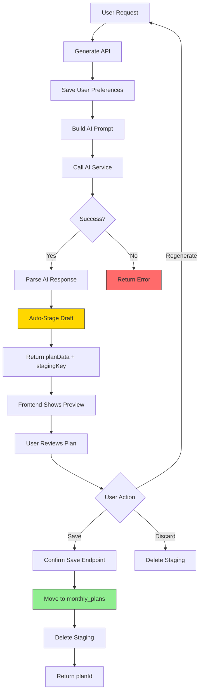
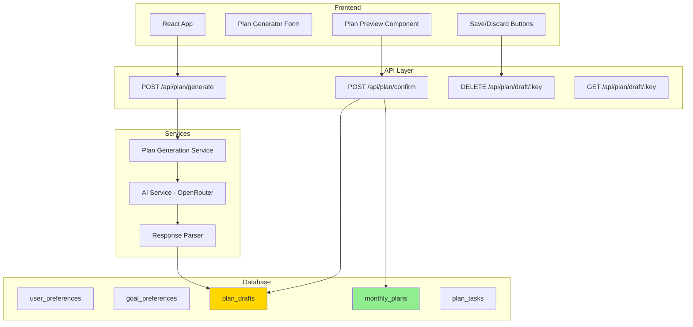

# Re-Cracked Hybrid Plan Generation Architecture

## 🎯 Executive Summary

This document is a **simplified rewrite** of the original "Cracked Hybrid" approach. The original design was over-engineered with unnecessary complexity. This version cuts the fat and focuses on what actually matters.

### The Simple Requirement

> "We want the user to see the generated plan, but don't want them to lose it when they refresh the webapp."

That's it. That's the whole requirement. Let's build exactly that.

---

## ❌ What We're Cutting (And Why)

### 1. The Decision Engine - **DELETED**

**Original:** Complex logic considering `isFirstTimeUser`, `hasGoodHistory`, `currentQuota`, `planComplexity`, `preferenceStrength` to decide whether to save immediately or preview.

**Why it's stupid:**

- We *always* want preview mode (user should see the plan first)
- We *always* want to not lose it on refresh
- There's no decision to make - just do both

**New approach:** Always generate → always auto-stage → always show preview → user decides to save.

---

### 2. Triple Save Modes - **DELETED**

**Original:** `immediate` | `preview` | `auto` modes with `createStagingBackup` boolean.

**Why it's stupid:** This creates 6+ possible code paths for something that should have 1 path.

**New approach:** One mode - **Generate and Stage**. Always.

---

### 3. Lightweight vs Regular Staging - **DELETED**

**Original:** Two types of staging with `is_lightweight` flag, different storage strategies.

**Why it's stupid:** Unnecessary branching. Just store what you need.

**New approach:** One staging table. Store the parsed plan data. That's it.

---

### 4. Internal Service HTTP Calls - **DELETED**

**Original:** Public API calls internal service API via HTTP fetch to itself.

**Why it's stupid:** You're adding network latency to call your own code. Just import the function.

**New approach:** Direct function calls.

---

### 5. `plan_generation_options` Table - **DELETED**

**Original:** Separate table for generation preferences like `defaultSaveMode`, `autoCreateStaging`, `stagingTtlHours`, `preferenceStrength`.

**Why it's stupid:**

- We don't need these options because we're not having multiple modes
- If we did need them, they belong in the existing `user_preferences` table

**New approach:** No new table. If we need preferences later, add columns to existing table.

---

### 6. Mock/Fallback Plans - **DELETED**

**Original:** Return fake hardcoded plan data when AI fails.

**Why it's stupid:** Don't lie to users. If generation fails, say so.

**New approach:** Return an error. User can retry.

---

### 7. `access_count` Tracking - **DELETED**

**Original:** Track how many times staging was accessed.

**Why it's stupid:** No clear use case. Just noise.

**New approach:** Deleted.

---

## ✅ The New Architecture

### Core Flow

```
┌─────────────────┐
│  User submits   │
│  goals/prefs    │
└────────┬────────┘
         │
         ▼
┌─────────────────┐
│  Generate Plan  │ ──────────┐
│  (Call AI)      │           │ On failure: return error
└────────┬────────┘           │
         │                    │
         ▼                    ▼
┌─────────────────┐    ┌─────────────┐
│  Auto-Stage     │    │  Error      │
│  (Save draft)   │    │  Response   │
└────────┬────────┘    └─────────────┘
         │
         ▼
┌─────────────────┐
│  Return plan +  │
│  stagingKey     │
└────────┬────────┘
         │
         ▼
┌─────────────────┐
│  Show Preview   │ ← User can refresh, plan survives
└────────┬────────┘
         │
         ▼ (User clicks "Save")
┌─────────────────┐
│  Confirm Save   │
│  (Staging → DB) │
└────────┬────────┘
         │
         ▼
┌─────────────────┐
│  Plan Saved ✓   │
└─────────────────┘
```

### Architecture Flow Diagram



### System Components



---

## 📋 Database Schema

### Only Change Needed: `plan_drafts` Table

This replaces the over-complicated `plan_staging` table.

```sql
CREATE TABLE plan_drafts (
  id SERIAL PRIMARY KEY,
  user_id TEXT NOT NULL REFERENCES "user"(id) ON DELETE CASCADE,
  draft_key TEXT NOT NULL UNIQUE,
  
  -- The actual plan data (JSON)
  plan_data JSONB NOT NULL,
  
  -- Reference to the preferences used for generation
  goal_preference_id INTEGER REFERENCES goal_preferences(id),
  month_year TEXT NOT NULL, -- '2024-01-01' format
  
  -- Simple metadata
  created_at TIMESTAMP DEFAULT NOW(),
  expires_at TIMESTAMP NOT NULL,
  
  -- Index for cleanup job
  CONSTRAINT plan_drafts_user_key UNIQUE (user_id, draft_key)
);

-- Index for fetching user's drafts
CREATE INDEX idx_plan_drafts_user ON plan_drafts(user_id, expires_at);

-- Index for cleanup job
CREATE INDEX idx_plan_drafts_expires ON plan_drafts(expires_at);
```

**What we removed:**

- `is_lightweight` - No lightweight vs regular distinction
- `access_count` - Not needed
- `ai_response_raw` - We parse it immediately, don't need to store raw
- `extraction_confidence` - Nice to have, but not critical for MVP
- `extraction_notes` - Debug info, not for production

**What we kept:**

- The essential data needed to recover the plan on refresh

---

## 🔧 Backend Implementation

### File Structure (Simplified)

```
packages/
├── db/
│   └── src/
│       └── queries/
│           └── plan-drafts.ts       # NEW: Simple draft CRUD
│
└── api/
    └── src/
        └── routers/
            └── plan.ts              # All plan endpoints (generate, confirm, draft)
```

### Step 1: Database Queries

#### File: `packages/db/src/queries/plan-drafts.ts`

```typescript
import { db } from "../index";
import { eq, and, lt } from "drizzle-orm";
import { planDrafts } from "../schema";

// Generate a simple draft key
export function generateDraftKey(userId: string): string {
  const timestamp = Date.now();
  const random = Math.random().toString(36).substring(2, 8);
  return `draft_${userId.slice(-6)}_${timestamp}_${random}`;
}

// Create a draft (auto-stage)
export async function createDraft(
  userId: string,
  planData: any,
  goalPreferenceId: number,
  monthYear: string,
  ttlHours: number = 24
): Promise<{ draftKey: string }> {
  const draftKey = generateDraftKey(userId);
  const expiresAt = new Date();
  expiresAt.setHours(expiresAt.getHours() + ttlHours);

  await db.insert(planDrafts).values({
    userId,
    draftKey,
    planData,
    goalPreferenceId,
    monthYear,
    expiresAt,
  });

  return { draftKey };
}

// Get a draft by key
export async function getDraft(
  userId: string,
  draftKey: string
): Promise<any | null> {
  const [draft] = await db
    .select()
    .from(planDrafts)
    .where(
      and(
        eq(planDrafts.userId, userId),
        eq(planDrafts.draftKey, draftKey)
      )
    );

  if (!draft || new Date() > draft.expiresAt) {
    return null;
  }

  return draft;
}

// Delete a draft
export async function deleteDraft(
  userId: string,
  draftKey: string
): Promise<void> {
  await db
    .delete(planDrafts)
    .where(
      and(
        eq(planDrafts.userId, userId),
        eq(planDrafts.draftKey, draftKey)
      )
    );
}

// Get user's latest draft (for recovery on page load)
export async function getLatestDraft(userId: string): Promise<any | null> {
  const [draft] = await db
    .select()
    .from(planDrafts)
    .where(eq(planDrafts.userId, userId))
    .orderBy(planDrafts.createdAt)
    .limit(1);

  if (!draft || new Date() > draft.expiresAt) {
    return null;
  }

  return draft;
}

// Cleanup expired drafts (run as cron job)
export async function cleanupExpiredDrafts(): Promise<number> {
  const result = await db
    .delete(planDrafts)
    .where(lt(planDrafts.expiresAt, new Date()));

  return result.rowCount || 0;
}
```

### Step 2: Plan Generation Service

#### File: `packages/api/src/services/plan-generation.ts`

```typescript
import { 
  createGoalPreference,
  createDraft,
  getDraft,
  deleteDraft,
  saveGeneratedPlan 
} from "@testing-server/db";
import { getOpenRouterService } from "../lib/openrouter";
import { responseExtractor } from "@testing-server/response-parser";

export interface GeneratePlanInput {
  userId: string;
  goalsText: string;
  taskComplexity: "Simple" | "Balanced" | "Ambitious";
  focusAreas: string;
  weekendPreference: "Work" | "Rest" | "Mixed";
  fixedCommitmentsJson: {
    commitments: Array<{
      dayOfWeek: string;
      startTime: string;
      endTime: string;
      description: string;
    }>;
  };
}

export interface GeneratePlanResult {
  success: true;
  draftKey: string;
  planData: any;
  preferenceId: number;
  generatedAt: string;
}

export interface GeneratePlanError {
  success: false;
  error: string;
}

export async function generatePlan(
  input: GeneratePlanInput
): Promise<GeneratePlanResult | GeneratePlanError> {
  try {
    // 1. Save user preferences/goals
    const preference = await createGoalPreference({
      userId: input.userId,
      goalsText: input.goalsText,
      taskComplexity: input.taskComplexity,
      focusAreas: input.focusAreas,
      weekendPreference: input.weekendPreference,
      fixedCommitmentsJson: input.fixedCommitmentsJson,
    });

    if (!preference) {
      return { success: false, error: "Failed to save planning inputs" };
    }

    // 2. Build prompt and call AI
    const prompt = buildPrompt(input);
    const openRouter = getOpenRouterService();
    const aiResponse = await openRouter.generatePlan(prompt);

    // 3. Parse AI response
    const parsedResponse = responseExtractor.extractAllStructuredData(
      aiResponse.rawContent
    );
    const monthYear = new Date().toISOString().slice(0, 7) + "-01";
    const planData = responseExtractor.convertToMonthlyPlan(
      parsedResponse,
      monthYear
    );

    // 4. Auto-stage the draft (so it survives refresh)
    const { draftKey } = await createDraft(
      input.userId,
      planData,
      preference.id,
      monthYear
    );

    // 5. Return the plan + draft key
    return {
      success: true,
      draftKey,
      planData,
      preferenceId: preference.id,
      generatedAt: new Date().toISOString(),
    };
  } catch (error) {
    console.error("Plan generation failed:", error);
    return {
      success: false,
      error: error instanceof Error ? error.message : "Generation failed",
    };
  }
}

export async function confirmPlan(
  userId: string,
  draftKey: string
): Promise<{ success: true; planId: number } | { success: false; error: string }> {
  try {
    // 1. Get the draft
    const draft = await getDraft(userId, draftKey);
    if (!draft) {
      return { success: false, error: "Draft not found or expired" };
    }

    // 2. Save to permanent storage
    const planId = await saveGeneratedPlan(
      userId,
      draft.goalPreferenceId,
      draft.monthYear,
      "", // prompt - we don't need to store this
      {
        rawContent: JSON.stringify(draft.planData),
        metadata: { 
          contentLength: JSON.stringify(draft.planData).length, 
          format: "json" as const 
        },
      }
    );

    // 3. Delete the draft
    await deleteDraft(userId, draftKey);

    return { success: true, planId };
  } catch (error) {
    console.error("Plan confirm failed:", error);
    return {
      success: false,
      error: error instanceof Error ? error.message : "Save failed",
    };
  }
}

function buildPrompt(input: GeneratePlanInput): string {
  // Build the AI prompt from user input
  return `Generate a monthly productivity plan with the following requirements:
  
Goals: ${input.goalsText}
Task Complexity: ${input.taskComplexity}
Focus Areas: ${input.focusAreas}
Weekend Preference: ${input.weekendPreference}
Fixed Commitments: ${JSON.stringify(input.fixedCommitmentsJson)}

Please provide a structured plan with weekly breakdowns and daily tasks.`;
}
```

### Step 3: API Routes

#### File: `apps/server/src/router/plan.ts`

```typescript
import { Hono } from "hono";
import { zValidator } from "@hono/zod-validator";
import { z } from "zod";
import { 
  generatePlan, 
  confirmPlan 
} from "@testing-server/api/services/plan-generation";
import { 
  getDraft, 
  deleteDraft, 
  getLatestDraft 
} from "@testing-server/db";
import type { Variables } from "../index";

const generateInputSchema = z.object({
  userId: z.string(),
  goalsText: z.string().min(1),
  taskComplexity: z.enum(["Simple", "Balanced", "Ambitious"]),
  focusAreas: z.string().min(1),
  weekendPreference: z.enum(["Work", "Rest", "Mixed"]),
  fixedCommitmentsJson: z.object({
    commitments: z.array(
      z.object({
        dayOfWeek: z.string(),
        startTime: z.string(),
        endTime: z.string(),
        description: z.string(),
      })
    ),
  }),
});

export const planRouter = new Hono<{ Variables: Variables }>();

// ============================================
// POST /api/plan/generate
// Generate a new plan and auto-stage it
// ============================================
planRouter.post(
  "/generate",
  zValidator("json", generateInputSchema),
  async (c) => {
    const data = c.req.valid("json");
    const userId = c.get("session")?.user?.id || data.userId;

    const result = await generatePlan({ ...data, userId });

    if (!result.success) {
      return c.json({ success: false, error: result.error }, 500);
    }

    return c.json({
      success: true,
      data: {
        draftKey: result.draftKey,
        planData: result.planData,
        preferenceId: result.preferenceId,
        generatedAt: result.generatedAt,
      },
      message: "Plan generated. Review and save when ready.",
    });
  }
);

// ============================================
// POST /api/plan/confirm
// Save a drafted plan permanently
// ============================================
planRouter.post(
  "/confirm",
  zValidator("json", z.object({ draftKey: z.string() })),
  async (c) => {
    const { draftKey } = c.req.valid("json");
    const userId = c.get("session")?.user?.id;

    if (!userId) {
      return c.json({ success: false, error: "Authentication required" }, 401);
    }

    const result = await confirmPlan(userId, draftKey);

    if (!result.success) {
      return c.json({ success: false, error: result.error }, 400);
    }

    return c.json({
      success: true,
      data: { planId: result.planId },
      message: "Plan saved successfully!",
    });
  }
);

// ============================================
// GET /api/plan/draft/:key
// Retrieve a draft (for page refresh recovery)
// ============================================
planRouter.get("/draft/:key", async (c) => {
  const draftKey = c.req.param("key");
  const userId = c.get("session")?.user?.id;

  if (!userId) {
    return c.json({ success: false, error: "Authentication required" }, 401);
  }

  const draft = await getDraft(userId, draftKey);

  if (!draft) {
    return c.json({ success: false, error: "Draft not found or expired" }, 404);
  }

  return c.json({
    success: true,
    data: {
      planData: draft.planData,
      draftKey: draft.draftKey,
      createdAt: draft.createdAt,
      expiresAt: draft.expiresAt,
    },
  });
});

// ============================================
// GET /api/plan/draft
// Get latest draft for current user (auto-recovery)
// ============================================
planRouter.get("/draft", async (c) => {
  const userId = c.get("session")?.user?.id;

  if (!userId) {
    return c.json({ success: false, error: "Authentication required" }, 401);
  }

  const draft = await getLatestDraft(userId);

  if (!draft) {
    return c.json({ success: true, data: null }); // No draft is OK
  }

  return c.json({
    success: true,
    data: {
      planData: draft.planData,
      draftKey: draft.draftKey,
      createdAt: draft.createdAt,
      expiresAt: draft.expiresAt,
    },
  });
});

// ============================================
// DELETE /api/plan/draft/:key
// Discard a draft
// ============================================
planRouter.delete("/draft/:key", async (c) => {
  const draftKey = c.req.param("key");
  const userId = c.get("session")?.user?.id;

  if (!userId) {
    return c.json({ success: false, error: "Authentication required" }, 401);
  }

  await deleteDraft(userId, draftKey);

  return c.json({
    success: true,
    message: "Draft discarded",
  });
});
```

---

## 🎨 Frontend Implementation

### File: `apps/web/src/hooks/usePlanGeneration.ts`

```typescript
import { useState, useEffect, useCallback } from "react";

const API_BASE = import.meta.env.VITE_API_BASE_URL || "";

interface PlanData {
  monthly_summary: string;
  weekly_breakdown: any[];
}

interface DraftState {
  draftKey: string;
  planData: PlanData;
  createdAt: string;
  expiresAt: string;
}

interface GenerateInput {
  goalsText: string;
  taskComplexity: "Simple" | "Balanced" | "Ambitious";
  focusAreas: string;
  weekendPreference: "Work" | "Rest" | "Mixed";
  fixedCommitmentsJson: { commitments: any[] };
}

export function usePlanGeneration(userId: string) {
  const [draft, setDraft] = useState<DraftState | null>(null);
  const [isGenerating, setIsGenerating] = useState(false);
  const [isSaving, setIsSaving] = useState(false);
  const [error, setError] = useState<string | null>(null);

  // On mount, check for existing draft (page refresh recovery)
  useEffect(() => {
    checkForExistingDraft();
  }, [userId]);

  const checkForExistingDraft = useCallback(async () => {
    try {
      const response = await fetch(`${API_BASE}/api/plan/draft`, {
        credentials: "include",
      });
      const result = await response.json();

      if (result.success && result.data) {
        setDraft(result.data);
      }
    } catch (err) {
      // Silent fail - no draft is fine
      console.log("No existing draft found");
    }
  }, []);

  const generate = useCallback(async (input: GenerateInput) => {
    setIsGenerating(true);
    setError(null);

    try {
      const response = await fetch(`${API_BASE}/api/plan/generate`, {
        method: "POST",
        headers: { "Content-Type": "application/json" },
        credentials: "include",
        body: JSON.stringify({ userId, ...input }),
      });

      const result = await response.json();

      if (!result.success) {
        throw new Error(result.error || "Generation failed");
      }

      setDraft({
        draftKey: result.data.draftKey,
        planData: result.data.planData,
        createdAt: result.data.generatedAt,
        expiresAt: new Date(Date.now() + 24 * 60 * 60 * 1000).toISOString(),
      });

      return result.data;
    } catch (err) {
      const message = err instanceof Error ? err.message : "Generation failed";
      setError(message);
      throw err;
    } finally {
      setIsGenerating(false);
    }
  }, [userId]);

  const save = useCallback(async () => {
    if (!draft) {
      setError("No draft to save");
      return null;
    }

    setIsSaving(true);
    setError(null);

    try {
      const response = await fetch(`${API_BASE}/api/plan/confirm`, {
        method: "POST",
        headers: { "Content-Type": "application/json" },
        credentials: "include",
        body: JSON.stringify({ draftKey: draft.draftKey }),
      });

      const result = await response.json();

      if (!result.success) {
        throw new Error(result.error || "Save failed");
      }

      setDraft(null); // Clear draft after save
      return result.data.planId;
    } catch (err) {
      const message = err instanceof Error ? err.message : "Save failed";
      setError(message);
      throw err;
    } finally {
      setIsSaving(false);
    }
  }, [draft]);

  const discard = useCallback(async () => {
    if (!draft) return;

    try {
      await fetch(`${API_BASE}/api/plan/draft/${draft.draftKey}`, {
        method: "DELETE",
        credentials: "include",
      });
      setDraft(null);
    } catch (err) {
      console.error("Failed to discard draft:", err);
    }
  }, [draft]);

  return {
    // State
    draft,
    planData: draft?.planData || null,
    isGenerating,
    isSaving,
    error,
    hasDraft: !!draft,

    // Actions
    generate,
    save,
    discard,
    clearError: () => setError(null),
  };
}
```

### File: `apps/web/src/components/PlanGenerator.tsx`

```tsx
import React, { useState } from "react";
import { usePlanGeneration } from "../hooks/usePlanGeneration";

interface PlanGeneratorProps {
  userId: string;
}

export function PlanGenerator({ userId }: PlanGeneratorProps) {
  const {
    planData,
    isGenerating,
    isSaving,
    error,
    hasDraft,
    generate,
    save,
    discard,
    clearError,
  } = usePlanGeneration(userId);

  const [formData, setFormData] = useState({
    goalsText: "",
    taskComplexity: "Balanced" as const,
    focusAreas: "",
    weekendPreference: "Mixed" as const,
  });

  const handleGenerate = async () => {
    await generate({
      ...formData,
      fixedCommitmentsJson: { commitments: [] },
    });
  };

  const handleSave = async () => {
    const planId = await save();
    if (planId) {
      alert(`Plan saved! ID: ${planId}`);
      // Navigate to plan view, etc.
    }
  };

  return (
    <div className="plan-generator">
      {/* Error Display */}
      {error && (
        <div className="error-banner">
          <p>{error}</p>
          <button onClick={clearError}>Dismiss</button>
        </div>
      )}

      {/* Existing Draft Recovery Notice */}
      {hasDraft && !isGenerating && (
        <div className="draft-notice">
          <p>📝 You have an unsaved plan from a previous session.</p>
          <div className="draft-actions">
            <button onClick={handleSave} disabled={isSaving}>
              {isSaving ? "Saving..." : "Save This Plan"}
            </button>
            <button onClick={discard}>Discard & Start Over</button>
          </div>
        </div>
      )}

      {/* Plan Preview */}
      {planData && (
        <div className="plan-preview">
          <h2>Your Generated Plan</h2>
          <div className="plan-summary">
            <h3>Monthly Summary</h3>
            <p>{planData.monthly_summary}</p>
          </div>

          <div className="plan-weeks">
            {planData.weekly_breakdown?.map((week, i) => (
              <div key={i} className="week-card">
                <h4>Week {week.week}</h4>
                <p>{week.focus}</p>
              </div>
            ))}
          </div>

          <div className="plan-actions">
            <button 
              onClick={handleSave} 
              disabled={isSaving}
              className="primary"
            >
              {isSaving ? "Saving..." : "✓ Save Plan"}
            </button>
            <button onClick={discard} className="secondary">
              ✗ Discard
            </button>
            <button onClick={handleGenerate} className="secondary">
              ↻ Regenerate
            </button>
          </div>
        </div>
      )}

      {/* Generation Form (show when no plan) */}
      {!planData && (
        <div className="generation-form">
          <h2>Generate Your Plan</h2>

          <div className="form-group">
            <label>What are your goals?</label>
            <textarea
              value={formData.goalsText}
              onChange={(e) =>
                setFormData({ ...formData, goalsText: e.target.value })
              }
              placeholder="Describe what you want to achieve..."
            />
          </div>

          <div className="form-group">
            <label>Task Complexity</label>
            <select
              value={formData.taskComplexity}
              onChange={(e) =>
                setFormData({
                  ...formData,
                  taskComplexity: e.target.value as any,
                })
              }
            >
              <option value="Simple">Simple - Easy tasks</option>
              <option value="Balanced">Balanced - Mix of difficulty</option>
              <option value="Ambitious">Ambitious - Challenging tasks</option>
            </select>
          </div>

          <div className="form-group">
            <label>Focus Areas</label>
            <input
              type="text"
              value={formData.focusAreas}
              onChange={(e) =>
                setFormData({ ...formData, focusAreas: e.target.value })
              }
              placeholder="e.g., Work, Health, Learning"
            />
          </div>

          <div className="form-group">
            <label>Weekend Preference</label>
            <select
              value={formData.weekendPreference}
              onChange={(e) =>
                setFormData({
                  ...formData,
                  weekendPreference: e.target.value as any,
                })
              }
            >
              <option value="Work">Work - Include tasks on weekends</option>
              <option value="Mixed">Mixed - Light tasks on weekends</option>
              <option value="Rest">Rest - No tasks on weekends</option>
            </select>
          </div>

          <button
            onClick={handleGenerate}
            disabled={isGenerating || !formData.goalsText}
            className="generate-button"
          >
            {isGenerating ? "Generating..." : "✨ Generate Plan"}
          </button>
        </div>
      )}
    </div>
  );
}
```

---

## 📊 Comparison: Before vs After

| Aspect | Original "Cracked" | Simplified |
|--------|-------------------|------------|
| **API Endpoints** | 6+ endpoints (public + internal) | 4 endpoints |
| **Database Tables** | 2 new tables | 1 new table |
| **Save Modes** | 3 modes + auto | 1 mode (always stage → confirm) |
| **Decision Logic** | Complex context analysis | None |
| **Code Paths** | 6+ branching paths | 2 paths (success/error) |
| **Internal HTTP Calls** | Yes (fetch to self) | No (direct function calls) |
| **Lines of Code (est.)** | ~800+ | ~300 |

---

## 🔄 Flow Summary

### What Actually Happens

```
1. User fills form → clicks "Generate"
2. Backend: Save preferences, call AI, parse response
3. Backend: Auto-save to plan_drafts table
4. Backend: Return planData + draftKey
5. Frontend: Store draftKey in state, show preview
6. (User refreshes page)
7. Frontend: On mount, fetch /api/plan/draft → recover draft
8. User clicks "Save"
9. Backend: Copy from plan_drafts → monthly_plans, delete draft
10. Done.
```

### What We Removed

- Decision logic about whether to save immediately
- Multiple save modes that confuse users
- Internal HTTP calls between our own services  
- Separate preference table for generation options
- Complex staging types
- Mock/fallback plans
- Excessive metadata

---

## 🧹 Cleanup: Cron Job for Expired Drafts

```typescript
// Run daily or hourly
import { cleanupExpiredDrafts } from "@testing-server/db";

async function runCleanup() {
  const deletedCount = await cleanupExpiredDrafts();
  console.log(`Cleaned up ${deletedCount} expired drafts`);
}
```

---

## 🎯 Success Metrics (Simplified)

Track these, nothing more:

1. **Generation success rate** - Did AI call succeed?
2. **Draft → Save conversion** - Are users saving their plans?
3. **Draft expiration rate** - Are users abandoning drafts?
4. **Average time to save** - How long between generate and save?

---

## 💡 Future Improvements (When Justified)

Only add these **after** shipping the MVP and seeing real usage patterns:

1. **Multiple drafts** - If users want to compare multiple generated plans
2. **Draft editing** - If users want to tweak the plan before saving
3. **Preference memory** - Store last used taskComplexity, etc. (add to existing user_preferences table)
4. **Generation history** - If users want to regenerate with same inputs

---

## 🏁 Conclusion

The original "Cracked Hybrid" architecture tried to solve problems we don't have yet:

- Complex decision logic for problems users haven't expressed
- Multiple modes for flexibility we don't need
- Optimization before measurement

This simplified version does exactly what's needed:

1. Generate a plan
2. Don't lose it on refresh
3. Let user save when ready

**Ship this. Measure. Then add complexity only where data shows it's needed.**
