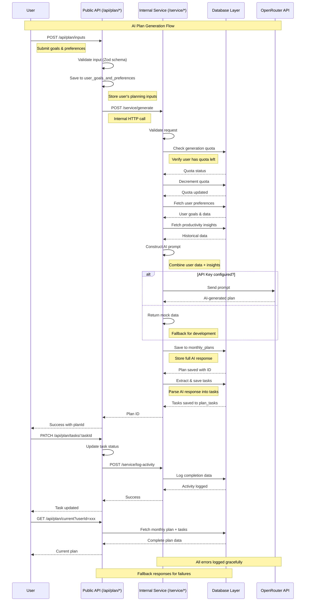

# Request Flow Documentation

## Overview

This document illustrates how requests flow through the testing-server application, focusing on the AI-powered monthly plan generation feature.

## Architecture Diagram



## Key Architecture Points

### 1. Layer Separation

```
┌─────────────────┐     ┌──────────────────┐     ┌─────────────────┐
│  Public API     │────▶│ Internal Service │────▶│   Database      │
│ (/api/plan/*)   │     │ (/service/*)     │     │ (queries/*)     │
│                 │     │                  │     │                 │
│ • HTTP handling │     │ • Business     │     │ • Data ops      │
│ • Validation   │     │ • Orchestration│     │ • No external  │
│ • Error format │     │ • AI calls      │     │   dependencies │
└─────────────────┘     └──────────────────┘     └─────────────────┘
```

### 2. Flow Priority

1. **User Request** → **Public API** (`/api/plan/inputs`) - First point of contact
2. **Public API** → **Internal Service** (`/service/generate`) - Business logic delegation
3. **Internal Service** → **Database** → **OpenRouter** → **Database** - Heavy lifting

### 3. Error Handling Strategy

- **Graceful Degradation**: System continues working even when OpenRouter is unavailable
- **Fallback Responses**: Mock data ensures development can proceed without API key
- **Error Logging**: All failures are logged for debugging
- **User-Friendly Errors**: Clear error messages without exposing internal details

## Request Flow Details

### Plan Generation Flow

```bash
POST /api/plan/inputs
{
  "userId": "user_123",
  "goalsText": "Learn TypeScript and build projects",
  "taskComplexity": "Balanced",
  "focusAreas": "Programming, Learning",
  "weekendPreference": "Mixed",
  "fixedCommitmentsJson": {
    "commitments": [
      {
        "dayOfWeek": "Monday",
        "startTime": "09:00",
        "endTime": "17:00",
        "description": "Work hours"
      }
    ]
  }
}
```

### Internal Service Call

```bash
POST /service/generate
{
  "preferenceId": 42,
  "userId": "user_123"
}
```

### Database Operations Sequence

1. **Check Quota**: Verify user hasn't exceeded monthly limit
2. **Decrement Quota**: Reserve a generation slot
3. **Fetch Preferences**: Get user's goals and settings
4. **Fetch Insights**: Retrieve historical productivity data
5. **Construct Prompt**: Build comprehensive AI prompt
6. **Call AI**: Send to OpenRouter (or use mock)
7. **Save Response**: Store in `monthly_plans` table
8. **Extract Tasks**: Parse and save to `plan_tasks` table

## Environment Variables

Configure these in `apps/server/.env`:

```env
# API Configuration
API_BASE_URL=http://localhost:3000  # Optional, defaults to localhost:3000

# OpenRouter Configuration
OPENROUTER_API_KEY=your_api_key_here
OPENROUTER_MODEL=anthropic/claude-3.5-sonnet
OPENROUTER_TEMPERATURE=0.7
OPENROUTER_MAX_TOKENS=4000
```

## Benefits of This Architecture

1. **Testability**: Each layer can be tested independently
2. **Scalability**: Services can be scaled separately
3. **Maintainability**: Clear separation of concerns
4. **Flexibility**: Easy to add new features or modify existing ones
5. **Resilience**: System continues working with fallbacks

## Key Files

- **`apps/server/src/router/plan.ts`**: Public API endpoints
- **`apps/server/src/router/services.ts`**: Internal service logic
- **`apps/server/src/lib/openrouter.ts`**: OpenRouter service module
- **`packages/db/src/queries/plan-generation.ts`**: Database operations
- **`packages/db/src/schema/`**: Database table definitions

This architecture ensures clean separation of concerns while maintaining a robust and scalable system for AI-powered plan generation.