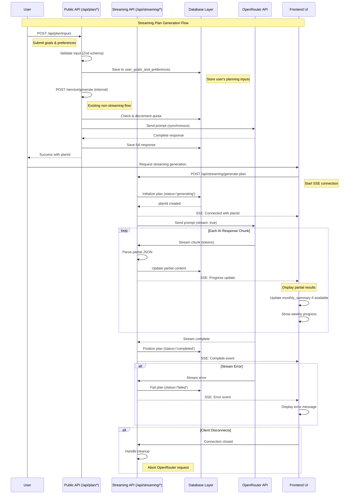

# OpenRouter Streaming Integration Guide

## Overview

This document explains how OpenRouter streaming has been integrated into the testing-server application to provide real-time AI plan generation with progressive UI updates.

## Architecture Overview

The streaming implementation maintains the existing synchronous flow while adding a new asynchronous streaming endpoint. This ensures backward compatibility while providing enhanced user experience.

### Key Components

1. **OpenRouter Service** (`apps/server/src/lib/openrouter.ts`) - Handles streaming API calls
2. **SSE Endpoint** (`apps/server/src/router/streaming.ts`) - Server-Sent Events endpoint
3. **Database Layer** (`packages/db/src/queries/plan-generation.ts`) - Incremental data persistence
4. **Streaming JSON Parser** - Processes partial JSON responses

## Request Flow Sequence Diagram



## Implementation Details

### 1. OpenRouter Service Enhancement

The `OpenRouterService` class now supports both synchronous and streaming generation:

```typescript
// apps/server/src/lib/openrouter.ts
export class OpenRouterService {
  // Existing synchronous method
  async generatePlan(prompt: string): Promise<any>

  // New streaming method
  async generatePlanStream(prompt: string): Promise<AsyncGenerator<StreamChunk>>
}
```

**Key Features:**
- Maintains backward compatibility
- Handles partial JSON responses
- Provides structured progress updates
- Supports cancellation mid-stream

### 2. Server-Sent Events Endpoint

New `/api/streaming/generate-plan` endpoint using Hono's `streamSSE`:

```typescript
// apps/server/src/router/streaming.ts
streamingRouter.post('/generate-plan', async (c) => {
  return streamSSE(c, async (stream) => {
    // Initialize plan, process stream, update database
  });
});
```

**Additional Endpoints:**

- `GET /api/streaming/status/:planId` - Check generation status
- `DELETE /api/streaming/cancel/:planId` - Cancel ongoing generation

**SSE Events:**
- `progress` - Partial content updates
- `error` - Streaming errors
- `complete` - Generation finished

### 3. Database Schema Updates

Added fields to `monthly_plans` table:

```sql
ALTER TABLE monthly_plans
ADD COLUMN status TEXT NOT NULL DEFAULT 'completed',
ADD COLUMN partial_content TEXT,
ADD COLUMN generation_started_at TIMESTAMP;
```

**Status Values:**
- `generating` - Stream in progress
- `partial` - Partial content saved
- `completed` - Successfully finished
- `failed` - Error occurred

### 4. Streaming JSON Parser

Handles partial JSON from OpenRouter's token stream:

```typescript
class StreamingJSONParser {
  addChunk(chunk: string): any | null {
    // Accumulate and parse partial JSON
  }
}
```

## Frontend Integration

### SSE Client Implementation

```typescript
// Client-side SSE handling
const response = await fetch('/api/streaming/generate-plan', {
  method: 'POST',
  headers: { 'Content-Type': 'application/json' },
  body: JSON.stringify({ preferenceId, userId })
});

const reader = response.body?.getReader();
const decoder = new TextDecoder();

while (true) {
  const { done, value } = await reader.read();
  if (done) break;

  const chunk = decoder.decode(value);
  // Parse SSE format and update UI
}
```

### Progressive UI Updates

1. **Initial Connection**
   - Show loading indicator
   - Display plan ID

2. **Monthly Summary**
   - Update as soon as available
   - Show partial summary

3. **Weekly Progress**
   - Update count of completed weeks
   - Show weekly breakdowns as they arrive

4. **Error States**
   - Handle connection errors
   - Display retry options

## Error Handling

### Streaming-Specific Errors

1. **Early Errors** (before streaming starts)
   - Standard HTTP error responses
   - Quota exceeded, invalid input

2. **Mid-Stream Errors**
   - Sent as SSE error events
   - Network failures, API errors
   - Automatic cleanup and status updates

3. **Client Disconnection**
   - Abort OpenRouter request
   - Update plan status to 'failed'
   - Clean up resources

### Error Recovery

- Automatic retry for transient failures
- Fallback to synchronous endpoint on persistent errors
- Clear error messages for users
- Proper database state maintenance

## Performance Benefits

### Memory Optimization
- Process responses incrementally
- Reduced memory footprint for large plans
- Better garbage collection behavior

### User Experience
- Immediate feedback on progress
- Reduced perceived wait time
- Ability to see partial results
- Better error visibility

### System Reliability
- Graceful degradation on errors
- Maintain database consistency
- Support for cancellation
- Better resource utilization

## Testing Strategy

### Unit Tests
1. **StreamingJSONParser** - Test partial JSON parsing
2. **OpenRouterService** - Mock streaming responses
3. **Database Functions** - Test incremental saves
4. **SSE Handler** - Test error scenarios

### Integration Tests
1. **End-to-End Flow** - Complete streaming with database
2. **Error Handling** - Network failures, API errors
3. **Concurrency** - Multiple simultaneous streams
4. **Performance** - Memory usage, response times

## Configuration

### Environment Variables

```env
# Existing OpenRouter configuration
OPENROUTER_API_KEY=your_api_key_here
OPENROUTER_MODEL=anthropic/claude-3.5-sonnet
OPENROUTER_TEMPERATURE=0.7
OPENROUTER_MAX_TOKENS=4000

# Streaming-specific (optional)
STREAMING_TIMEOUT=300000  # 5 minutes
STREAMING_CHUNK_SIZE=1024 # bytes
```

## Migration Guide

### For Existing Applications

1. **No Breaking Changes** - Existing `/service/generate` endpoint unchanged
2. **Opt-In Streaming** - Use new endpoint when streaming is desired
3. **Database Migration** - Run schema migration for new fields
4. **Frontend Updates** - Implement SSE client for streaming UI

### Step-by-Step Migration

1. Update database schema
2. Deploy backend with streaming support
3. Test streaming endpoint
4. Update frontend to use streaming
5. Monitor performance and usage

## Best Practices

### Backend
- Always validate input before starting stream
- Implement proper cleanup on errors
- Use transactions for database consistency
- Log streaming metrics for monitoring

### Frontend
- Handle connection drops gracefully
- Implement retry logic with exponential backoff
- Show clear progress indicators
- Provide fallback to non-streaming flow

### Monitoring
- Track streaming success rates
- Monitor average streaming duration
- Alert on high error rates
- Log partial failures for debugging

## Troubleshooting

### Common Issues

1. **SSE Connection Drops**
   - Check network stability
   - Verify CORS configuration
   - Implement reconnection logic

2. **JSON Parsing Errors**
   - Check OpenRouter model response format
   - Validate StreamingJSONParser implementation
   - Add error logging for debugging

3. **Database Timeouts**
   - Optimize database queries
   - Implement connection pooling
   - Use transactions properly

### Debug Tips

- Enable debug logging for streaming
- Monitor database query performance
- Test with different OpenRouter models
- Verify SSE event format validity

## Future Enhancements

1. **WebSocket Support** - For bi-directional communication
2. **Streaming Cancellation** - User-initiated stop
3. **Batch Streaming** - Process multiple plans simultaneously
4. **Progress Metrics** - More detailed progress information
5. **Resume Capability** - Resume interrupted streams

## Conclusion

The OpenRouter streaming integration provides significant improvements to user experience and system performance while maintaining full backward compatibility. The implementation follows best practices for error handling, database consistency, and progressive enhancement.